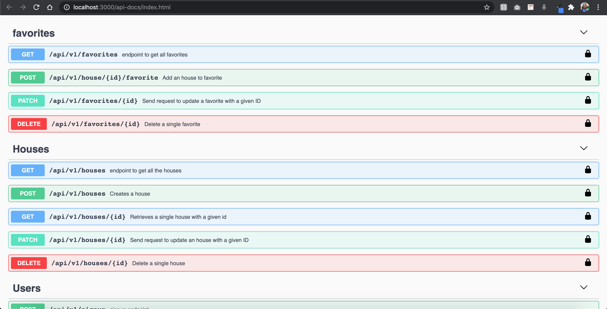

<h1 align="center">
  <br>
  
  <br>
  DREAM HOUSE API
  <br>
</h1>

<h4 align="center">Api project build with RUBY ON RAILS, and swagger for documentation </h4>

<p align="center"> 
  <a href="https://twitter.com/certilremy">
      
  </a>
  <a href="https://www.paypal.me/certilremy">
    
  </a>
</p>

<p align="center">
  <a href="#about">About</a> •
  <a href="#developement">Using the developement</a> •
  <a href="https://dreamhouse-swagger.herokuapp.com/api-docs/index.html">Live Doc interaction</a> •
  <a href="#documentation">Usin the documentation</a> •
  <a href="#dependency">Dependencys</a>
</p>


## About

Dream house API , is a simple aplication where, user can see house and add them to favorite. Only admin can add edit and delete house. Live production of the API can be found here https://dreamhouse-swagger.herokuapp.com/api-docs/index.html


## Developement 

To run the app in your computer. Clone and run this application, you'll need [Git](https://git-scm.com) and [Rails](https://rubyonrails.org/) installed on your computer. From your command line:

```bash
# Clone this repository
$ git clone https://github.com/certilremy/dreamhouse-api.git

# Go into the repository
$ cd dreamhouse-api

# Install dependencies
$ bundle install

# Run the app
$ rails s

```
Note, to run the tests do not run  `` bundle exec rspec spec``

Run this 

```bash
$ rake rswag:specs:swaggerize
```

This will run all the tests, If you make change to any file to the spec/integration folder , it will update the documentation.

## Documentation

You can go there to test the [live documentation interaction](https://dreamhouse-swagger.herokuapp.com/api-docs/index.html). As you can see in the video, you must be logged in. IF you do not have an account create one in the signup endpoint with the documentation.

## Dependency

This API uses the following open source packages:

- RSWAG (Documentation)
- JWT (For token based authentication)
- RSPEC (For testing)
- Rack-cors (Cross origin post)
- PG (Database)

## You may also like...

- [Time tracker](https://github.com/certilremy/time_tracker) - Time management app build with ruby on rails
- [Wild Escape](https://github.com/certilremy/wild_escape) - 2D game build with phaser.io ( JavaScript)

## Contribution
If you want to contribute to this project, Fork this repo, add your feature and open pull request. You're welcome

## License

MIT

---

## contact

> GitHub [@certilremy](https://github.com/certilremy) &nbsp;&middot;&nbsp;
> Twitter [@certilremy](https://twitter.com/certilremy)

If you learn someting in this project or you like it give it a start!
